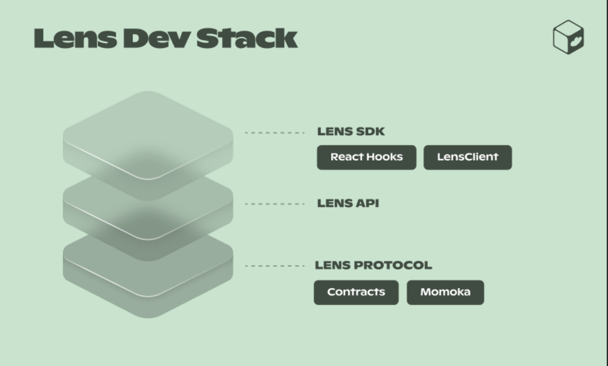

## Lens Protocol Workshop

In this workshop you'll learn how to use Next.js, TypeScript, Lens Protocol, and the [Lens SDK](https://docs.lens.xyz/docs/sdk-react-intro) to build out a social application.

The app we'll be building will have the following features:

1. When the app loads, it will render a list of recommended users from the Lens API along with their profile picture and bio
2. When we click on a user, we will navigate to a detail view where we will see all of their publications as well as more profile details
3. The user profile view will also have the option for a user to sign in and follow another user.

By the end of this tutorial you'll have a good understanding of how to get started building on Lens with TypeScript and the Lens SDK.



### Getting started

To get started, create a new Next.js application:

```sh
npx create-next-app lens-app

✔ Would you like to use TypeScript with this project? Yes
✔ Would you like to use ESLint with this project? Yes
✔ Would you like to use Tailwind CSS with this project?  Yes
✔ Would you like to use `src/` directory with this project? No
✔ Use App Router (recommended)? Yes
✔ Would you like to customize the default import alias? No
```

Next, change into the new directory and install the following dependencies:

```sh
cd lens-app

npm install @lens-protocol/react-web ethers@legacy-v5 wagmi@0.12.7 @lens-protocol/wagmi
```

## app/layout.tsx

Next, we want to configure our app to use the Lens SDK. 

This is typically done at the entrypoint to the app, and only needs to be done once.

This is a decent amount of code, but once it's set up it makes using the SDK very easy in our components.

Update `app/layout.tsx` with the following code:

```tsx
'use client'
import './globals.css'
import { configureChains, createClient, WagmiConfig } from 'wagmi'
import { mainnet, polygon } from 'wagmi/chains'
import { publicProvider } from 'wagmi/providers/public'
import { LensProvider, LensConfig, production } from '@lens-protocol/react-web'
import { bindings as wagmiBindings } from '@lens-protocol/wagmi'
const { provider, webSocketProvider } = configureChains([polygon, mainnet], [publicProvider()])

const client = createClient({
  autoConnect: true,
  provider,
  webSocketProvider,
});

const lensConfig: LensConfig = {
  bindings: wagmiBindings(),
  environment: production,
};

export default function RootLayout({
  children,
}: {
  children: React.ReactNode
}) {
  return (
    <html lang="en">
      <WagmiConfig client={client}>
        <LensProvider config={lensConfig}>
          <body>{children}</body>
        </LensProvider>
     </WagmiConfig>
    </html>
  )
}
```

## format picture utility

Next, we'll need a helper function to format the pictures coming back to use with IPFS and Arweave gateways. By default, we'll only have the hash.

In the root directory, create a file named `utils.ts` and add the following code:

```typescript
// utils.ts
export function formatPicture(picture: any) {
  if (picture.__typename === 'MediaSet') {
    if (picture.original.url.startsWith('ipfs://')) {
      let result = picture.original.url.substring(7, picture.original.url.length)
      return `http://lens.infura-ipfs.io/ipfs/${result}`
    } else if (picture.original.url.startsWith('ar://')) {
      let result = picture.original.url.substring(4, picture.original.url.length)
      return `http://arweave.net/${result}`
    } else {
      return picture.original.url
    }
  } else {
    return picture
  }
}
```

## app/page.tsx

Next, let's query for profiles and render them in our app.

To do so, open `app/page.tsx` and add the following code:

```typescript
// app/page.tsx
'use client'
import { useExploreProfiles } from '@lens-protocol/react-web'
import Link from 'next/link'
import { formatPicture } from '../utils'

export default function Home() {
  const { data } = useExploreProfiles({
    limit: 25
  })
  
  return (
    <div className='p-20'>
      <h1 className='text-5xl'>My Lens App</h1>
      {
        data?.map((profile, index) => (
          <Link href={`/profile/${profile.handle}`} key={index}>
            <div className='my-14'>
              {
                profile.picture && profile.picture.__typename === 'MediaSet' ? (
                  
                ) : <div className="w-14 h-14 bg-slate-500	" />
              }
              <h3 className="text-3xl my-4">{profile.handle}</h3>
              <p className="text-xl">{profile.bio}</p>
            </div>
          </Link>
        ))
      }
    </div>
  )
}

```

#### What's happening?

In `useExploreProfiles`, we are calling the Lens API to fetch a list of recommended profiles.

The `formatPicture` function updates the image metadata to provide either an IPFS or Arweave gateway to each hash.

### Testing it out

To run the app, run the following command:

```sh
npm run dev
```

## Profile View

In the above code, we've added a link to each profile that, when clicked, will navigate to `/profile/profile.id`. What we want to happen is that when a user navigates to that page, they are able to view more details about that profile.

We also want go give users a way to sign in and follow users.

This functionality does not yet exist, so let's create it.


### Adding the ABI

Next, we'll need the ABI from the contract we'll be interacting with to allow users to follow other users.

Create a file named `abi.json` at the root of the project.

Next, copy the ABI from the [contract](https://polygonscan.com/address/0x20f4D7DdeE23029048C53B42dc73A02De19F1c9E#ddExportABI) located [here](https://gist.github.com/dabit3/71d8fac2ea4081f32903cb479ea2881a) into this file and save it.

### Profile view

In the `app` directory, create a new folder named `profile`.

In the `profile` directory create a new folder named `[id]`.

In the `[id]` folder, create a new file named `page.tsx`.

In this file, add the following code:

```typescript
// app/profile/[id]/page.tsx
'use client'

import { useState, useEffect } from 'react'
import { usePathname } from 'next/navigation'
import { ethers } from 'ethers'
import { useProfile, usePublications } from '@lens-protocol/react-web'
import { formatPicture } from '../../../utils'
import ABI from '../../../abi.json'

const CONTRACT_ADDRESS = '0xDb46d1Dc155634FbC732f92E853b10B288AD5a1d'

export default function Profile() {
  const [connected, setConnected] = useState<boolean>(false)
  const [account, setAccount] = useState('')

  const pathName = usePathname()
  const handle = pathName?.split('/')[2]

  const { data: profile } = useProfile({ handle })

  useEffect(() => {
    checkConnection()
  }, [handle])

  async function checkConnection() {
    if (!window.ethereum) return
    const provider = new ethers.providers.Web3Provider(window.ethereum as any)
    const addresses = await provider.listAccounts();
    if (addresses.length) {
      setConnected(true)
    } else {
      setConnected(false)
    }
  }

  async function connectWallet() {
    if (!window.ethereum) return
    const accounts = await window.ethereum.request({
      method: "eth_requestAccounts"
    })
    console.log('accounts: ', accounts)
    accounts[0]
    setAccount(account)
    setConnected(true)
  }

  function getSigner() {
    const provider = new ethers.providers.Web3Provider(window.ethereum as any)
    return provider.getSigner();
  }

  async function followUser() {
    if (!profile) return
    const contract = new ethers.Contract(
      CONTRACT_ADDRESS,
      ABI,
      getSigner()
    )

    try {
      const tx = await contract.follow([profile.id], [0x0])
      await tx.wait()
      console.log(`successfully followed ... ${profile.handle}`)
    } catch (err) {
      console.log('error: ', err)
    }
  }

  if (!profile) return null

  return (
    <div>
      <div className="p-14">
        {
          !connected && (
            <button className="bg-white text-black px-14 py-4 rounded-full mb-4" onClick={connectWallet}>Connect Wallet</button>
          )
        }
        {
          profile.picture?.__typename === 'MediaSet' && (
            
          )
        }
        <h1 className="text-3xl my-3">{profile.handle}</h1>
        <h3 className="text-xl mb-4">{profile.bio}</h3>
        <Publications profile={profile} />
        {
          connected && (
            <button
              className="bg-white text-black px-14 py-4 rounded-full"
              onClick={followUser}
            >Follow {profile.handle}</button>
          )
        }
      </div>
    </div>
  )
}

function Publications({
  profile
}: {
  profile: any
}) {
  let { data: publications } = usePublications({
    profileId: profile.id,
    limit: 10,
  })
  publications = publications?.map(publication => {
    if (publication.__typename === 'Mirror') {
      return publication.mirrorOf
    } else {
      return publication
    }
  })

return (
    <>
      {
        publications?.map((pub: any, index: number) => (
          <div key={index} className="py-4 bg-zinc-900 rounded mb-3 px-4">
            <p>{pub.metadata.content}</p>
            {
              pub.metadata?.media[0]?.original && ['image/jpeg', 'image/png'].includes(pub.metadata?.media[0]?.original.mimeType) && (
                
              )
            }
          </div>
        ))
    }
    </>
  )
}
```

### Testing it out

To run the app, run the following command:

```sh
npm run dev
```

### Next Steps

Now that you've built your first basic application, it's time to explore more of the Lens API!

Consider diving into authentication, modules, or learning about gasless transactions and the dispatcher.

Also consider adding the following features to your new app:

- Searching for users
- Creating a post
